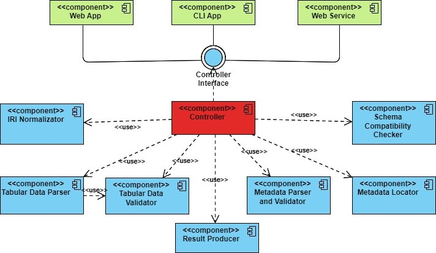
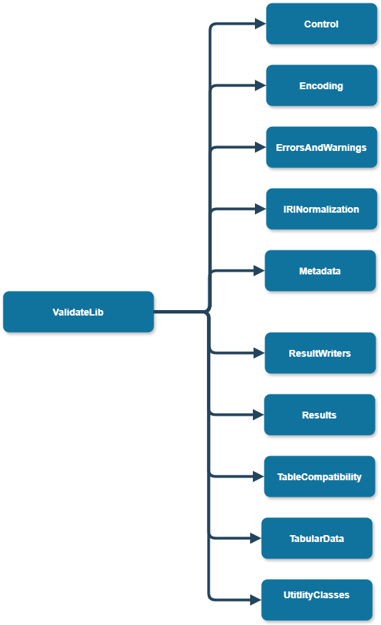

# Library - developer documentation

Here you can find all that you need if you want to continue the development of the Validator library or to 
use it more advanced!

Don't forget to check out the [user documentation](../user/) to get a grasp of what this library is all about!

## Generated code documentation
Firstly there is [documentation generated](pathname:///generated_docs/lib/generated/html/index.html) from the source code where you can find all the classes you will be working
with.

## General architecture

Here you can see the general architecture design of the application:


This design was created in the beginning and tries to reflect `single responsibility principle` as all of the modules should be isolated and the `Controllers` orchestrates the communication between them. One exception are the components `Tabular Data Validator` and `Tabular Data Parser` which communicate between each other because we wanted to reduce the time consumed by the intermediary communication through the `Controller` as the tabular data parsing and validation is the most time and resource consuming part of the validator.

## Contents of namespaces

Here you can see the individual sub namespaces of the main namespace of the validator lin = ValidateLib:


Now we will describe individual sub-namespaces and explain the most important classes and interfaces:
- **[ValidateLib.Control](#validatelibcontrol)**
- **[ValidateLib.Encoding](#validatelibencoding)**
- **[ValidateLib.ErrorsAndWarnings](#validateliberrorsandwarnings)**
- **[ValidateLib.IRINormalization](#validatelibirinormalization)**
- **[ValidateLib.Metadata](#validatelibmetadata)**
- **[ValidateLib.ResultWriters](#validatelibresultwriters)**
- **[ValidateLib.Results](#validatelibresults)**
- **[ValidateLib.TableCompatibility](#validatelibtablecompatibility)**
- **[ValidateLib.TabularData](#validatelibtabulardata)**
- **[ValidateLib.UtilityClasses](#validatelibutilityclasses)**

### ValidateLib.Control

Contains the most important interface `IController` which is entry-point into the validation and manages all other modules and their communication.
The interface is really documented in the detail so users can use it easily.
Check out the [generated documentation](pathname:///generated_docs/lib/generated/html/index.html).

Also there is `ControllerFactory` class which is used to produce the `IController` instances. We did this so we can change the implementations of `IController` without the users of the library even noticing.

### ValidateLib.Encoding

This contains the classes that provide some functionality related to the encoding detection.
[Generated documentation](https://drexem.github.io/validateIT/docs/lib/developer/generated/html/dc/d74/namespace_validate_lib_1_1_encoding.html).

### ValidateLib.ErrorsAndWarnings

This contains all the errors and warnings that can be produced during the validation.

Class that is the parent class for both `Error` and `Warnings` is `ErrorOrWarning` and important method is:
```csharp
public virtual string GetMessage(CultureInfo cultureInfo)
```
Which retrieves localized message for the user to see based on the culture info provided.

Also we have factory classes `WarningFactory` and `ErrorFactory` for creating instances of these warnings and errors.

**We are not really satisfied with the design of this namespace and there might be some changes done to it in the future.**

See the [generated documentation](https://drexem.github.io/validateIT/docs/lib/developer/generated/html/db/dac/namespace_validate_lib_1_1_errors_and_warnings.html)

### ValidateLib.IRINormalization

This namespace has generally just one job and that is [iri normalization](https://www.w3.org/TR/2015/REC-tabular-data-model-20151217/#url-normalization).

See the [generated documentation](https://drexem.github.io/validateIT/docs/lib/developer/generated/html/d9/dd8/namespace_validate_lib_1_1_i_r_i_normalization.html).

### ValidateLib.Metadata

This namespaces contains a lot of embedded namespaces and forms an essential part of the validator. Its main goals are providing classes for the metadata parsing and validation stage where we extract the metadata from metadata file and create internal model of this.

It contains embedded namespaces:
- **Descriptors** - contains classes representing individual descriptors described in the specification for example [table descriptor](https://www.w3.org/TR/2015/REC-tabular-metadata-20151217/#tables) or [table group descriptor](https://www.w3.org/TR/2015/REC-tabular-metadata-20151217/#table-groups). These classes contain a lot of methods used for the [normalization](https://www.w3.org/TR/2015/REC-tabular-metadata-20151217/#normalization) or for parsing individual properties.
- **DialectExtraction** - contains classes that extracts dialect from table descriptor-
- **Embedded** - contains classes that extracts embedded metadata from the tabular data file.
- **ErrorHandling** - contains classes that enables more detailed warnings and errors messages
- **MetadataLocation** - contains classes that [locate](https://www.w3.org/TR/2015/REC-tabular-data-model-20151217/#locating-metadata) the metadata.
- **Parsers** - contains a parser class for each of the descriptor that parses the class. Most of the parses just inherit from the `DescriptorParserBase` which provides the needed functionality as it is generic and it calls the right methods like `GetPropertyParser(JProperty property, List<Warning> warnings)` from the interface `IParsable<T>` which all of the descriptors must implement.
- **ParsingAndValidation** - contains class `MetadataParseValidator` which orchestrates all of the submodules in this module and provides some unified interface for parsing and validating the metadata file.
- **PropertyParsers** - contains individual property parsers. When we want to parse some property represented as a `JProperty` the individual `Parser` (from Parsers namespaces) just calls a `GetPropertyParser` on particular descriptor and it produces a parser which is then able to parse this property.
- **Unification** - contains classes that helps unify the state in which we have our metadata model before starting tabular data parsing and validation. It creates file wrappers for every table file so we download it just once and then use it from the disk. Also we want to start every validation as Table group validation so we unify it before the process begins.
- **Validators** - Contains validators of individual descriptors. Some of the descriptors can have some advanced rules of what combination of properties they are allowed to contain like for example `ForeignKeyDescriptor` cannot contain arbitrary foreign keys. They must exist in some table schema in the table group or table descriptor.

See the [generated documentation](https://drexem.github.io/validateIT/docs/lib/developer/generated/html/d9/dfb/namespace_validate_lib_1_1_metadata.html).
### ValidateLib.ResultWriters

This contains classes for creating result files in different formats. Contains enumeration of currently supported result file formats [ResultFileFormat](https://drexem.github.io/validateIT/docs/lib/developer/generated/html/df/d30/namespace_validate_lib_1_1_result_creators.html#a8b9472c929716cd2be72ad7157264e0b). Also contains [ResultWriterFactory](https://drexem.github.io/validateIT/docs/lib/developer/generated/html/d5/d2d/class_validate_lib_1_1_result_creators_1_1_result_writer_factory.html) which creates instances of the result writers based on the enumeration mentioned before.

See the [generated documentation](https://drexem.github.io/validateIT/docs/lib/developer/generated/html/d3/dce/namespace_validate_lib_1_1_result_writers.html).

### ValidateLib.Results

Contains files and interfaces that represent the result of validation. Most important are `ITableGroupValidationDetail`,`ITableValidationDetail`, `IResult` which user can directly access and use them as they are return values for the `Controller`

See the [generated documentation](https://drexem.github.io/validateIT/docs/lib/developer/generated/html/dd/d1b/namespace_validate_lib_1_1_results.html).

### ValidateLib.TableCompatibility

Contains classes that verifies that two [table descriptors](https://www.w3.org/TR/2015/REC-tabular-metadata-20151217/#tables) are compatible as defined in [specification](https://www.w3.org/TR/2015/REC-tabular-metadata-20151217/#table-description-compatibility).

See the [generated documentation](https://drexem.github.io/validateIT/docs/lib/developer/generated/html/d1/d4a/namespace_validate_lib_1_1_table_compatibility.html).

### ValidateLib.TabularData

Second biggest namespace after the `Metadata`.
It contains following sub-namespaces:
- **AnnotatedTabularDataModel** - contains classes that represent the [annotated tabular data model](https://www.w3.org/TR/2015/REC-tabular-data-model-20151217/) like for example annotated table, table group, row, cell, column etc. We map the entities from `Metadata` namespace to these basically.
- **Datatypes** - contains a lot of classes that represent individual datatypes that are allowed to be defined in the [metadata vocabulary](https://www.w3.org/TR/2015/REC-tabular-metadata-20151217/).
- **Parsing** - contains classes that are used to parse the tabular data files based on the dialect descriptor that was found during the metadata localization or was defined in the metadata document. Class `Flags` contains information extracted from dialect descriptor used for parsing the tabular data file. Also we created a `CustomStreamReader` that buffs the characters from the `StreamReader` class so we can go forward and backward in the stream. These classes create huge bottleneck of the parsing and it is a space for possible improvements on the efficiency of the whole validator.
- **Validation** - validation is done basically by the two main validation rules `ICellValidationRule` - to which we pass `AnnotatedCell` and it validates different aspects of it for example if the datatype matches desired datatype of the column the cell is in. `IRowValidationRule` - to which we pass `AnnotatedRow` and it validates different aspects of it for example that each row contains same amount of fields. Then there are some exceptions like `FKValidationRule` because the validation of foreign keys is more demanding and complex. This is ready for future extensions as we just need to create more validation rules in the future (we will probably add reflection to create such classes on demand of the user). `TabularDataTableValidator` orchestrates parsing and validation of one tabular data file. `TabularDataTableGroupValidator` orchestrates parsing and validation of all the tabular data files inside the table group.
  

See the [generated documentation](https://drexem.github.io/validateIT/docs/lib/developer/generated/html/dc/d9c/namespace_validate_lib_1_1_tabular_data.html).

### ValidateLib.UtilityClasses

Contains utility classes that helps other modules fullfil their tasks.

See the [generated documentation](https://drexem.github.io/validateIT/docs/lib/developer/generated/html/dc/df0/namespace_validate_lib_1_1_utility_classes.html).
