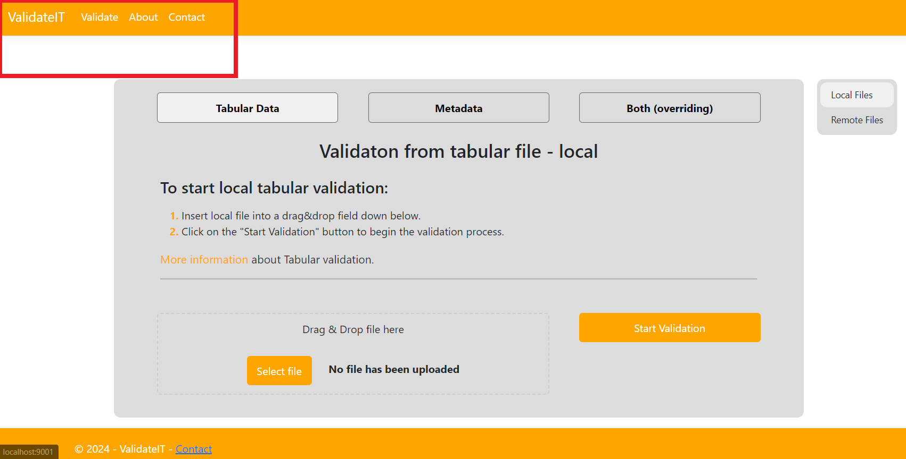
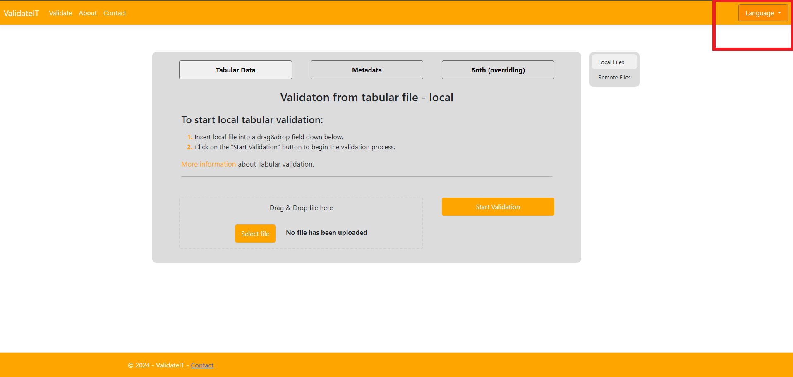
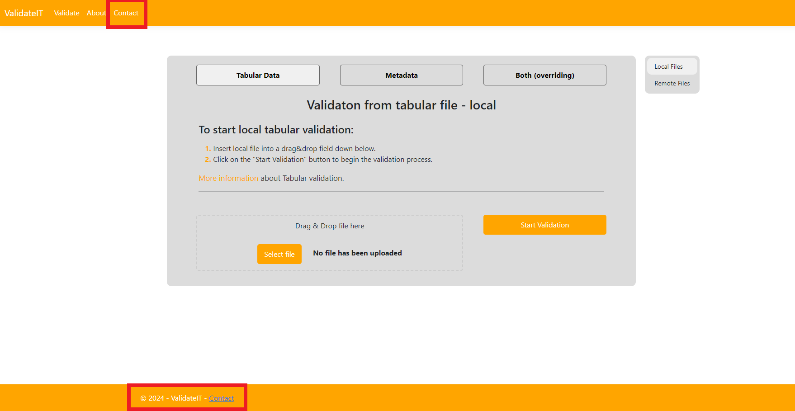
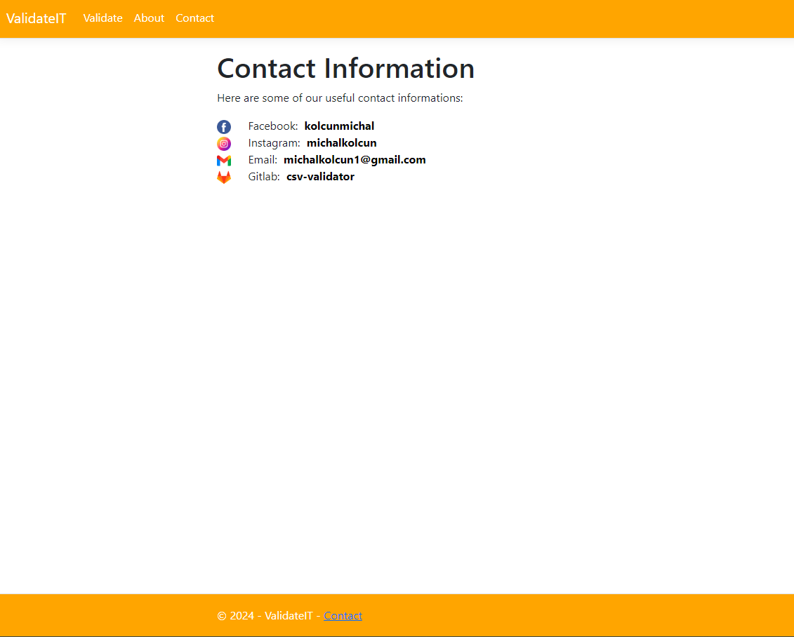
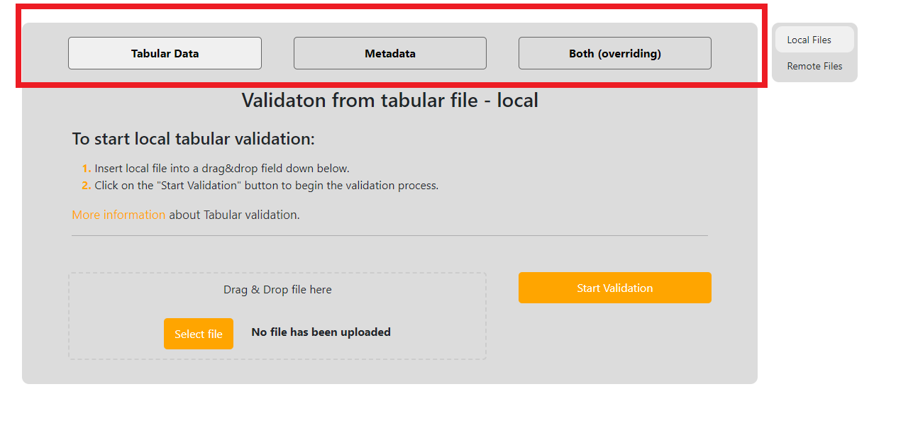
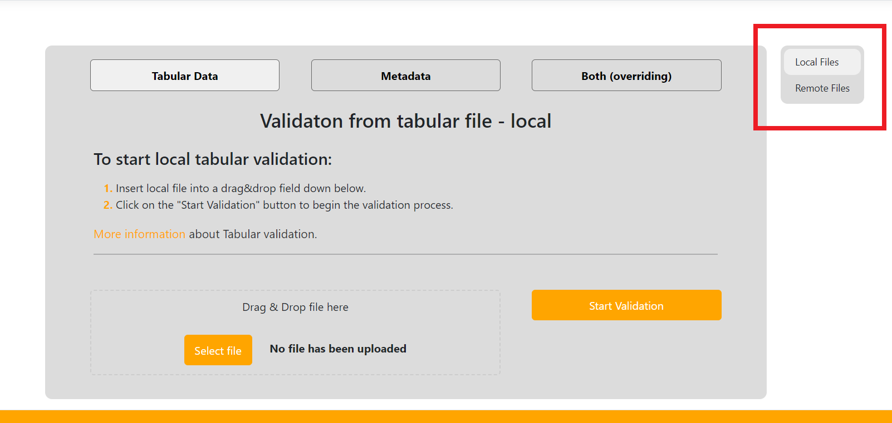
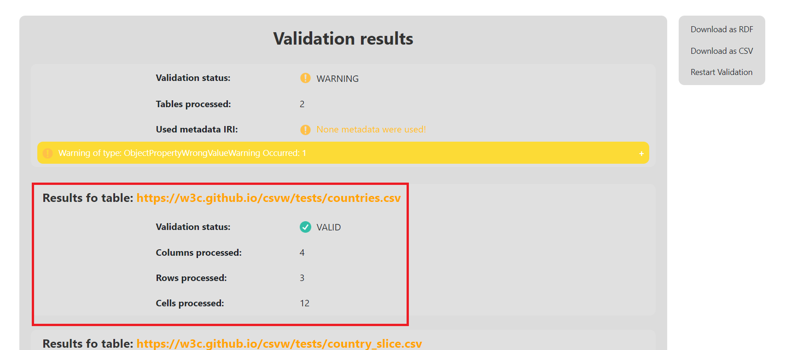
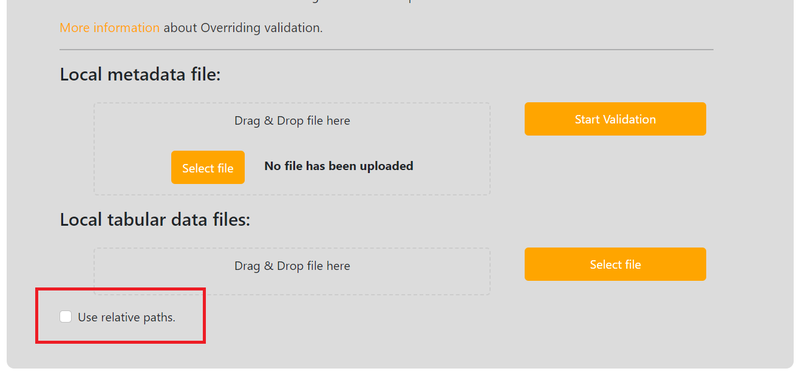

# Web App - user documentation

Here we will walk you through some typical usage scenarios and teach you how to use our Web application.
Before starting make sure you have read [general information](../../general/) about the validation.

We will use some local files to which we will always provide links for you to download them and try it out yourself. Generally the local example files are all situated [here](https://gitlab.mff.cuni.cz/kolcunm/csv-validator/-/tree/master/Docs/User/WebApp/Examples?ref_type=heads) so if you have cloned [the repository](https://gitlab.mff.cuni.cz/kolcunm/csv-validator) you have them ready.

## General information
Here will be really, really basic information about how to navigate around the webpage, which is not really interesting to people that know their way around the internet. You can [skip](#typical-usage-scenarios) to the [typical usage scenarios](#typical-usage-scenarios).
### Main navigation 
The main navigation bar is located at the top left corner of our web page:

And you can navigate to the Validation screens by clicking on the `ValidateIT` or `Validate` links, to the about page by clicking on `About` link or to the contact information by clicking on the `Contact` link.

### Selecting a language
Firstly we can switch between the two language variants of the web application by clicking on the language dropdown located at the top right corner of your screen:

And then choosing the language variant of the website you want to use (English/Slovak):

### Checking contact information

You can check the contact information by clicking on contact link in the [Main navigation](#main-navigation) or by clicking contact link in the `footer`:

And you will be redirected to a page like this:

### Checking about information

You can check information about the validator and get links to useful stuff by clicking on the `About` link in the [Main navigation](#main-navigation):

### Validate screens second navigation
If you are located at one of validate screens you can choose between different [types of validation](../../general/#validation-types) with the second navigation menu:

You can choose between:
- **[Tabular validation](../../general/#section-tabularValidation)** - by clicking on the link `Tabular Data`.
- **[Metadata validation](../../general/#section-metadataValidation)** - by clicking on the link `Metadata`
- **[Overriding validation](../../general/#section-overridingValidation)** - by clicking on the link `Both (overriding)`

### Validate screens third navigation
If you are located at one of validate screens you can typically choose between the local validation and remote validation (except for [Metadata validation](../../general/#section-metadataValidation)) by third navigation menu:

### Result page details
On the result page you can see the general information about the validation at the top of the screen:

It contains following properties:
- **Validation status** - this is the main property. It contains general status of validation:
  - `VALID` - no ERRORS or WARNINGS occurred during the validation
  - `WARNING` - WARNINGS occurred during the validation but no ERRORS occurred
  - `ERROR` - ERRORS occurred during the validation and possibly some WARNINGS too.
- **Tables processed** - contains number of tables processed during the validation
- **Used metadata IRI** - contains IRI of metadata file used for the validation. If you did not provide any you will see `None metadata were used` and small warning, because the best practice is to use metadata file, so maybe you just forgot to add it or you wanted it to be located but it was not.
- **Collapsibles of ERRORS and WARNINGS** - under these information you can see collapsibles of errors and warnings grouped by their type. Validator only shows first 15 errors of the same type, all errors can be shown on [another page](#validation-of-remote-csv-file-pp3).

You can see information related to one of the tables that has been validated down below:

It contains the following properties:
- **Validation status** - this contains validation status of particular table. Keywords have the same meaning as in the general case.
- **Columns processed** - how many columns have been processed in this table.
- **Rows processed** - how many rows have been processed in this table.
- **Cells processed** - how many cells have been processed in this table.
- **Collapsibles of ERRORS and WARNINGS** - under these information you can see collapsibles of errors and warnings grouped by their type. Validator only shows first 15 errors of the same type, all errors can be shown on [another page](#validation-of-remote-csv-file-pp3).

## Use relative paths

If you use local `Overriding` validation you can see a check-box saying: `Use relative paths.`

If you check this the validation will not be overriding. The provided local files
will be transferred to the server and put into one directory.
There will run classic `Metadata` validation beginning from the metadata file you provided.
This enables user to use `Metadata` validation even with the Web App form of validator!

## Typical usage scenarios

Here we will walk through some typical use cases. As mentioned [before](#web-app---user-documentation) we will work with some example files located [here](https://gitlab.mff.cuni.cz/kolcunm/csv-validator/-/tree/master/Attachments/Web_Service?ref_type=heads) so you can download them and work with us step by step!

Also in some of use cases we use [integration tests](https://w3c.github.io/csvw/tests/#manifest-validation) files.

Summary of use cases:
- **[Validation of local CSV file (PP1.)](pp1)**
- **[Validation of local metadata file (PP2. + PP5.)](pp2)**
- **[Validation of remote CSV file (PP3.)](pp3)**
- **[Validation of remote metadata file (PP4.)](pp4)**
- **[Validation of remote table group with remote metadata file (PP6.)](pp6)**

