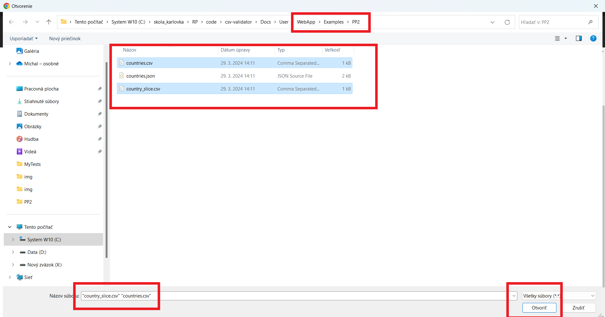
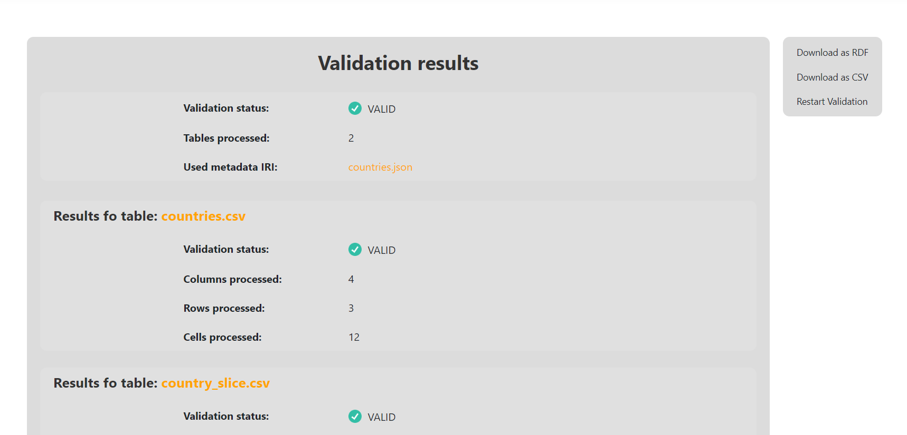

### Validation of local metadata file (PP2. + PP5.)

As the validation of just the local metadata file itself does not make much sense because metadata file must contain [Table descriptor](https://www.w3.org/TR/2015/REC-tabular-metadata-20151217/#tables) of at least one table, we need to upload local tabular data file with it.

We will be working with the files in directory [PP2/](https://gitlab.mff.cuni.cz/kolcunm/csv-validator/-/blob/master/Docs/User/WebApp/Examples/PP2/)

First lets locate to the correct validate screen.
1. Click on the `Validate` link in the [Main navigation](./#main-navigation).
2. Click on the `Both (overriding)` link in the [Second navigation](./#validate-screens-second-navigation).
3. Click on the `Local Files` link in the [Third navigation](./#validate-screens-third-navigation).

Now click on the top `Drag&Drop` field:

Select the metadata file called `countries.json`:

Click on the bottom `Drag&Drop` field:

Select the files `countries.csv` and `country_slice.csv`:

Make sure that the `countries.csv` is first, if you have wrong order you need to sort them like this:

Start the validation by clicking `Start Validation` button:

Afterwards you will see the result page:

We can see that the files are correct and none validation error has occurred!