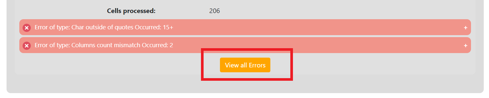

### Validation of remote CSV file (PP3.)

Now we will use file located at [PP3/example.csv](https://gitlab.mff.cuni.cz/kolcunm/csv-validator/-/blob/master/Docs/User/WebApp/Examples/PP3/example.csv) so we wil work with the link 
```
https://gitlab.mff.cuni.cz/kolcunm/csv-validator/-/blob/master/Docs/User/WebApp/Examples/PP3/example.csv
```
.

First lets locate to the correct validate screen.
1. Click on the `Validate` link in the [Main navigation](./#main-navigation).
2. Click on the `Tabular Data` link in the [Second navigation](./#validate-screens-second-navigation).
3. Click on the `Remote Files` link in the [Third navigation](./#validate-screens-third-navigation).

Insert the 
```
https://gitlab.mff.cuni.cz/kolcunm/csv-validator/-/blob/master/Docs/User/WebApp/Examples/PP3/example.csv
```
into the `URL input` field:

Start the validation by clicking on the `Start Validation` button:

Afterwards you will see this result page:

We can see that the error `Char outside of quotes` occurred more than 15 times, but the validator is only showing first 15 of errors of the same type. To see all of the errors associated with the table `https://gitlab.mff.cuni.cz/kolcunm/csv-validator/-/blob/master/Docs/User/WebApp/Examples/PP3/example.csv` we can click the `View all Errors` button:

This will relocate us to a site where we can see all of the 112 occurrences of the `Char outside of quotes` error:
