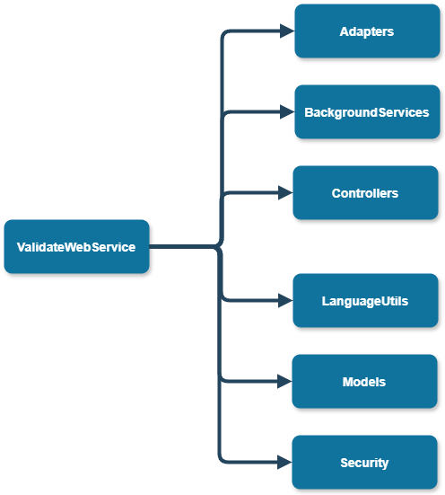

# Web Service - developer documentation

Here you can find all that you need if you want to continue the development of the Validator library or to 
use it more advanced!

Don't forget to check out the [user documentation](../user/index.md) to get a grasp of what this library is all about!

Contents:
- **[Generated documentation](#generated-code-documentation)**
- **[Contents of namespaces](#contents-of-namespaces)**

## Generated code documentation 
You can find the generated documentation from source code [here](pathname:///generated_docs/web_service/generated/html/index.html).
It contains detailed description of all classes and interfaces we need.

## Contents of namespaces

On this picture you can see all the embedded namespaces in the ValidateWebService namespace:

Now we will shortly describe them:
- **[Adapters](#adapters)**
- **[BackGroundServices](#backgroundservices)**
- **[Controllers](#controllers)**
- **[LanguageUtils](#languageutils)**
- **[Models](#models)**
- **[Security](#security)**

## Adapters

Contains classes that tries to mitigate the differences between the library variants. For example we need to store the errors and warnings serialized into the db and this is what these classes enable.

## BackGroundServices

TO this day we only have one background service called `Cleaning service`. It helps clean the database based on the configuration file of the server called `appsettings.json`. Every result of validation is stored to the database only for limited amount of time and this periodically scans the database and remove too old result instances.

## Controllers

Contains the `Controllers` instances that help serve the user request. We have to controllers `ValidateCOntroller` -> starts validation and creates new result instance in database which result id it returns to the user to poll, `GetResultController` which the user polls based on the provided resultID byt the `ValidateController`.

## LanguageUtils

Contains classes that helps recognize in which language does the user want the results to be generated.

## Models

Contains the classes that we serialize into the database, mainly mapping of the result classes from the `ValidateLib`.

## Security

Contains classes that helps with the problem of security of the web app.
For example it contains class `Sanitizer` which sanitizes the input from the user for example if he did not provide too big file or some malicious file names that could harm the server.