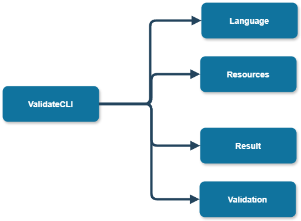

# Cli App - developer documentation

Here you can find all that you need if you want to continue the development of the Validator CLI App or to use it more advanced!

Don't forget to check out the [user documentation](../user/index.md) to get a grasp of what this CLI App is all about!

Contents:
- **[Generated documentation](#generated-code-documentation)**
- **[Contents of namespaces](#contents-of-namespaces)**

## Generated-code-documentation

You can find generated documentation by Doxygen in [here](Generated/html/index.html).
It contains description of all the classes we will be working with.

## Contents of namespaces

Here you can see all the embedded namespaces:

Now we will describe what do they contain:
- **Language** - contains classes that enable the localization of the CLI App. [Generated documentation]().
- ****