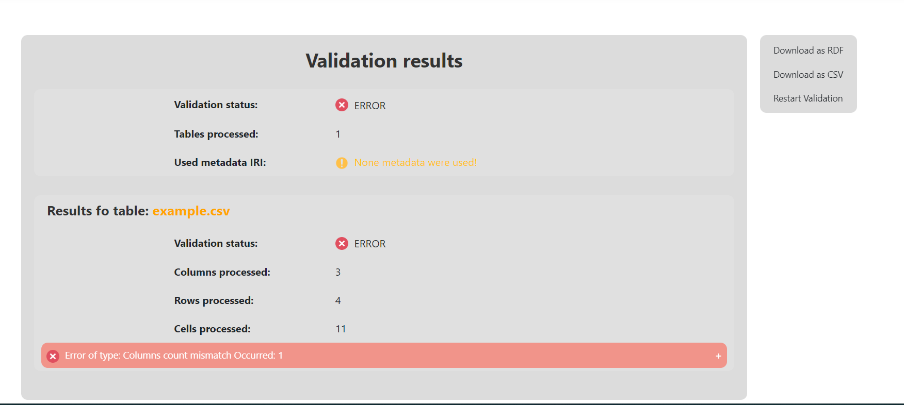
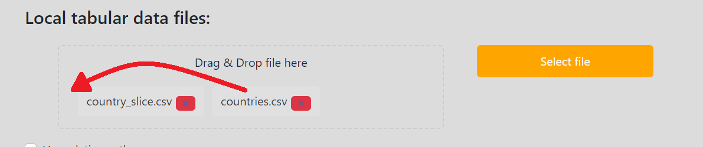
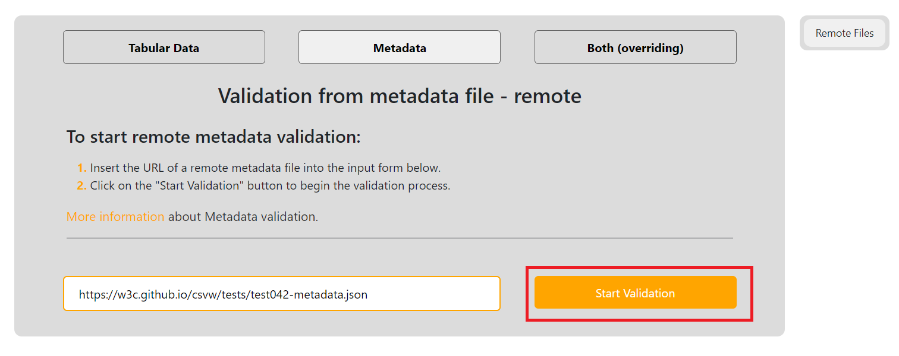
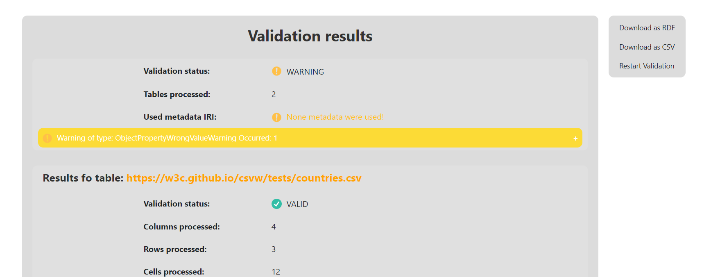

# Web App - user documentation

Here we will walk you through some typical usage scenarios and teach you how to use our Web application.
Before starting make sure you have read [general information](../general/index.md) about the validation.

We will use some local files to which we will always provide links for you to download them and try it out yourself. Generally the local example files are all situated [here](https://gitlab.mff.cuni.cz/kolcunm/csv-validator/-/tree/master/Docs/User/WebApp/Examples?ref_type=heads) so if you have cloned [the repository](https://gitlab.mff.cuni.cz/kolcunm/csv-validator) you have them ready.

## General information
Here will be really, really basic information about how to navigate around the webpage, which is not really interesting to people that now their way around the internet. You can [skip](#typical-usage-scenarios) to the [typical usage scenarios](#typical-usage-scenarios).
### Main navigation 
The main navigation bar is located at the top left corner of our web page:

And you can navigate to the Validation screens by clicking on the `ValidateIT` or `Validate` links, to the about page by clicking on `About` link or to the contact information by clicking on the `Contact` link.

### Selecting a language
Firstly we can switch between the two language variants of the web application by clicking on the language dropdown located at the top right corner of your screen:

And then choosing the language variant of the website you want to use (English/Slovak):

### Checking contact information

You can check the contact information by clicking on contact link in the [Main navigation](#main-navigation) or by clicking contact link in the `footer`:

And you will be redirected to a page like this:

### Checking about information

You can check information about the validator and get links to useful stuff by clicking on the `About` link in the [Main navigation](#main-navigation):

### Validate screens second navigation
If you are located at one of validate screens you can choose between different [types of validation](../general/index.md#validation-types) with the second navigation menu:

You can choose between:
- **[Tabular validation](../general/index.md#section-tabularValidation)** - by clicking on the link `Tabular Data`.
- **[Metadata validation](../general/index.md#section-metadataValidation)** - by clicking on the link `Metadata`
- **[Overriding validation](../general/index.md#section-overridingValidation)** - by clicking on the link `Both (overriding)`

### Validate screens third navigation
If you are located at one of validate screens you can typically choose between the local validation and remote validation (except for [Metadata validation](../general/index.md#section-metadataValidation)) by third navigation menu:

### Result page details
On the result page you can see the general information about the validation at the top of the screen:

It contains following properties:
- **Validation status** - this is the main property. It contains general status of validation:
  - `VALID` - no ERRORS or WARNINGS occurred during the validation
  - `WARNING` - WARNINGS occurred during the validation but no ERRORS occurred
  - `ERROR` - ERRORS occurred during the validation and possibly some WARNINGS too.
- **Tables processed** - contains number of tables processed during the validation
- **Used metadata IRI** - contains IRI of metadata file used for the validation. If you did not provide any you will see `None metadata were used` and small warning, because the best practice is to use metadata file, so maybe you just forgot to add it or you wanted it to be located but it was not.
- **Collapsibles of ERRORS and WARNINGS** - under these information you can see collapsibles of errors and warnings grouped by their type. Validator only shows first 15 errors of the same type, all errors can be shown on [another page](#validation-of-remote-csv-file-pp3).

You can see information related to one of the tables that has been validated down below:

It contains the following properties:
- **Validation status** - this contains validation status of particular table. Keywords have the same meaning as in the general case.
- **Columns processed** - how many columns have been processed in this table.
- **Rows processed** - how many rows have been processed in this table.
- **Cells processed** - how many cells have been processed in this table.
- **Collapsibles of ERRORS and WARNINGS** - under these information you can see collapsibles of errors and warnings grouped by their type. Validator only shows first 15 errors of the same type, all errors can be shown on [another page](#validation-of-remote-csv-file-pp3).

## Typical usage scenarios

Here we will walk through some typical use cases. As mentioned [before](#web-app---user-documentation) we will work with some example files located [here](https://gitlab.mff.cuni.cz/kolcunm/csv-validator/-/tree/master/Attachments/Web_Service?ref_type=heads) so you can download them and work with us step by step!

### Validation of local CSV file (PP1.)
Here we will work with the [PP1/example.csv](https://gitlab.mff.cuni.cz/kolcunm/csv-validator/-/blob/master/Docs/User/WebApp/Examples/PP1/example.csv?ref_type=heads)

First lets locate to the correct validate screen.
1. Click on the `Validate` link in the [Main navigation](#main-navigation).
2. Click on the `Tabular Data` link in the [Second navigation](#validate-screens-second-navigation).
3. Click on the `Local Files` link in the [Third navigation](#validate-screens-third-navigation).

Now click on the `Drag&Drop` field:

File select window will open and we select our file and click open:

Afterwards your page should look like this:

Now start the validation by clicking the `Start Validation` button:

After the validation is done, you will be relocated to a result page:

We can see that there has been one Columns count mismatch error:

And that it belongs to the table `example.csv` as it contains different number of columns in some row.

### Validation of local metadata file (PP2. + PP5.)

As the validation of just the local metadata file itself does not make much sense because metadata file must contain [Table descriptor](https://www.w3.org/TR/2015/REC-tabular-metadata-20151217/#tables) of at least one table, we need to upload local tabular data file with it.

We will be working with the files in directory [PP2/](https://gitlab.mff.cuni.cz/kolcunm/csv-validator/-/blob/master/Docs/User/WebApp/Examples/PP2/)

First lets locate to the correct validate screen.
1. Click on the `Validate` link in the [Main navigation](#main-navigation).
2. Click on the `Both (overriding)` link in the [Second navigation](#validate-screens-second-navigation).
3. Click on the `Local Files` link in the [Third navigation](#validate-screens-third-navigation).

Now click on the top `Drag&Drop` field:

Select the metadata file called `countries.json`:

Click on the bottom `Drag&Drop` field:

Select the files `countries.csv` and `country_slice.csv`:

Make sure that the `countries.csv` is first, if you have wrong order you need to sort them like this:

Start the validation by clicking `Start Validation` button:

Afterwards you will see the result page:

We can see that the files are correct and none validation error has occurred!

### Validation of remote CSV file (PP3.)

Now we will use file located at [PP3/example.csv](https://gitlab.mff.cuni.cz/kolcunm/csv-validator/-/blob/master/Docs/User/WebApp/Examples/PP3/example.csv) so we wil work with the link `https://gitlab.mff.cuni.cz/kolcunm/csv-validator/-/blob/master/Docs/User/WebApp/Examples/PP3/example.csv`.

First lets locate to the correct validate screen.
1. Click on the `Validate` link in the [Main navigation](#main-navigation).
2. Click on the `Tabular Data` link in the [Second navigation](#validate-screens-second-navigation).
3. Click on the `Remote Files` link in the [Third navigation](#validate-screens-third-navigation).

Insert the `https://gitlab.mff.cuni.cz/kolcunm/csv-validator/-/blob/master/Docs/User/WebApp/Examples/PP3/example.csv` into the `URL input` field:

Start the validation by clicking on the `Start Validation` button:

Afterwards you will see this result page:

We can see that the error `Char outside of quotes` occurred more than 15 times, but the validator is only showing first 15 of errors of the same type. To see all of the errors associated with the table `https://gitlab.mff.cuni.cz/kolcunm/csv-validator/-/blob/master/Docs/User/WebApp/Examples/PP3/example.csv` we can click the `View all Errors` button:

This will relocate us to a site where we can see all of the 112 occurrences of the `Char outside of quotes` error:

### Validation of remote metadata file (PP4.)
For this use case we will borrow one of the [integration tests](https://w3c.github.io/csvw/tests/#manifest-validation) specifically [test042](https://w3c.github.io/csvw/tests/#manifest-validation#test042).
Contents of this file will be are saved at [PP4/](https://gitlab.mff.cuni.cz/kolcunm/csv-validator/-/tree/master/Docs/User/WebApp/Examples/PP4).

First lets locate to the correct validate screen.
1. Click on the `Validate` link in the [Main navigation](#main-navigation).
2. Click on the `Metadata Data` link in the [Second navigation](#validate-screens-second-navigation).
3. Click on the `Remote Files` link in the [Third navigation](#validate-screens-third-navigation).

Insert the `https://w3c.github.io/csvw/tests/test042/csv-metadata.json` into the `URL input` field:

Start the validation by clicking on the `Start Validation` button: 

Afterwards you will see the result page:

Here the warning of wrong text direction property value has occurred.

### Validation of remote table group with remote metadata file (PP6.)

For this use case we will borrow one of the [integration tests](https://w3c.github.io/csvw/tests/#manifest-validation) specifically [test097](https://w3c.github.io/csvw/tests/#manifest-validation#test097).
Contents of this file will be are saved at [PP6/](https://gitlab.mff.cuni.cz/kolcunm/csv-validator/-/tree/master/Docs/User/WebApp/Examples/PP6).

First lets locate to the correct validate screen.
1. Click on the `Validate` link in the [Main navigation](#main-navigation).
2. Click on the `Both (overriding)` link in the [Second navigation](#validate-screens-second-navigation).
3. Click on the `Remote Files` link in the [Third navigation](#validate-screens-third-navigation).

Insert the `https://w3c.github.io/csvw/tests/test097-metadata.json` into the first `URL input` field:

Insert the `https://w3c.github.io/csvw/tests/countries.csv` into the second `URL input` field:

Add third input field by clicking `Add tabular file` button:

Insert the `https://w3c.github.io/csvw/tests/country_slice.csv` into the third `URL input` field:

Start the validation by clicking on the `Start Validation` button: 

Afterwards you will see the result page:

Here the warning of wrong object property value has occurred.

