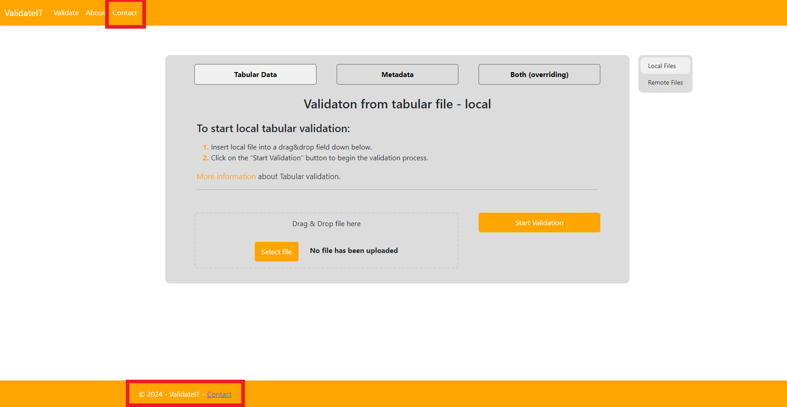
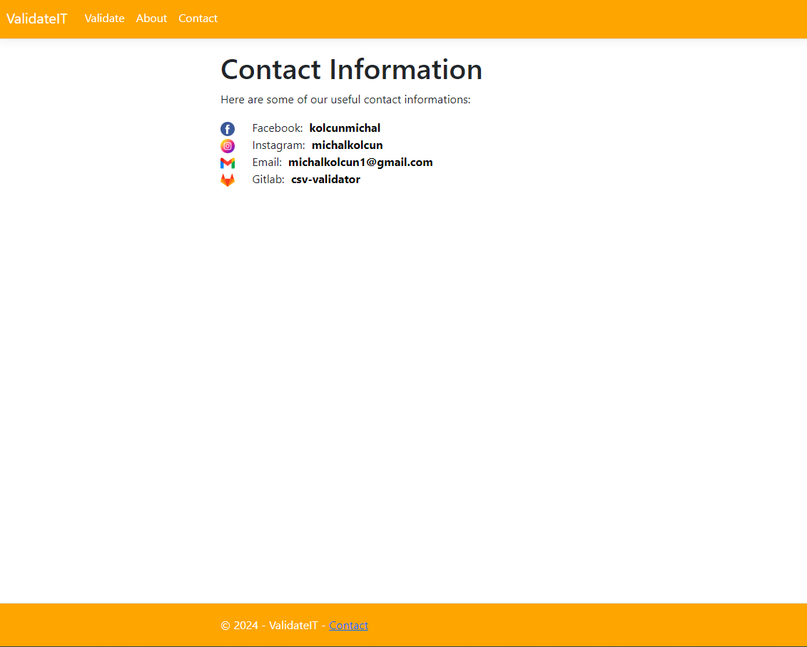
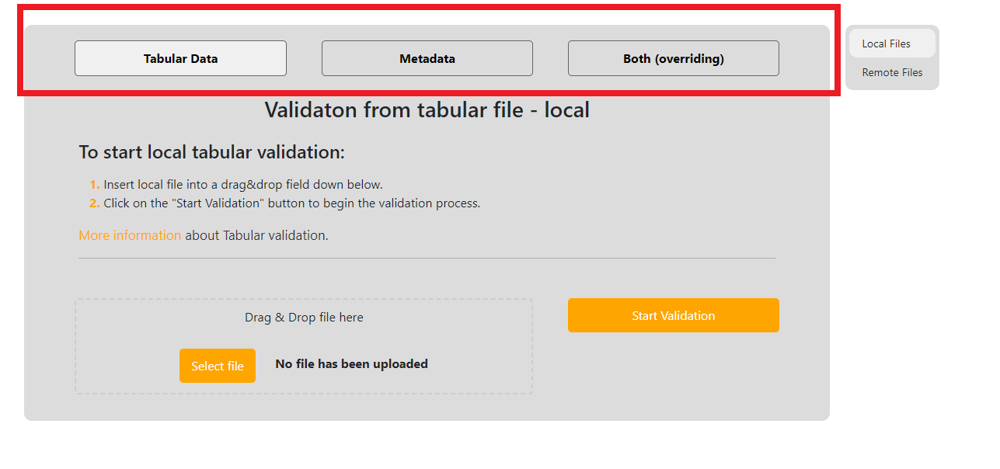
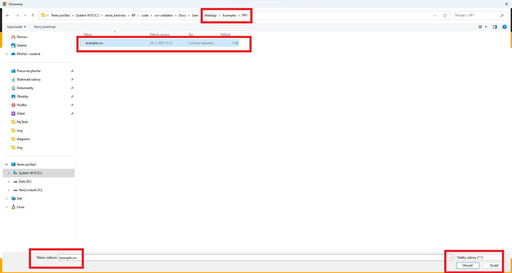
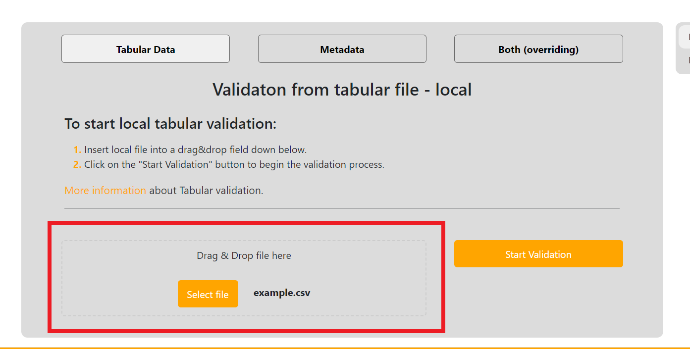
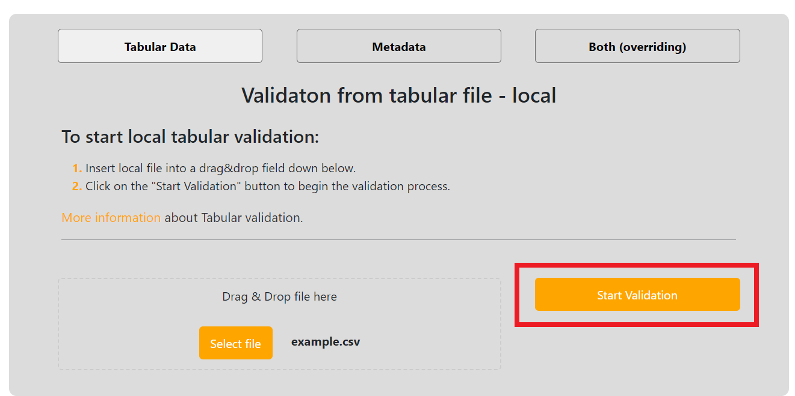

# Web App - user documentation

Here we will walk you through some typical usage scenarios and teach you how to use our Web application.
Before starting make sure you have read [general information](../general/index.md) about the validation.

We will use some local files to which we will always provide links for you to download them and try it out yourself. Generally the local example files are all situated [here](https://gitlab.mff.cuni.cz/kolcunm/csv-validator/-/tree/master/Docs/User/WebApp/Examples?ref_type=heads) so if you have cloned [the repository](https://gitlab.mff.cuni.cz/kolcunm/csv-validator) you have them ready.

## General information
Here will be really, really basic information about how to navigate around the webpage, which is not really interesting to people that now their way around the internet. You can [skip](#typical-usage-scenarios) to the [typical usage scenarios](#typical-usage-scenarios).
### Main navigation 
The main navigation bar is located at the top left corner of our web page:

And you can navigate to the Validation screens by clicking on the `ValidateIT` or `Validate` links, to the about page by clicking on `About` link or to the contact information by clicking on the `Contact` link.

### Selecting a language
Firstly we can switch between the two language variants of the web application by clicking on the language dropdown located at the top right corner of your screen:

And then choosing the language variant of the website you want to use (English/Slovak):

### Checking contact information

You can check the contact information by clicking on contact link in the [Main navigation](#main-navigation) or by clicking contact link in the `footer`:

And you will be redirected to a page like this:

### Checking about information

You can check information about the validator and get links to useful stuff by clicking on the `About` link in the [Main navigation](#main-navigation):

### Validate screens second navigation
If you are located at one of validate screens you can choose between different [types of validation](../general/index.md#validation-types) with the second navigation menu:

You can choose between:
- **[Tabular validation](../general/index.md#section-tabularValidation)** - by clicking on the link `Tabular Data`.
- **[Metadata validation](../general/index.md#section-metadataValidation)** - by clicking on the link `Metadata`
- **[Overriding validation](../general/index.md#section-overridingValidation)** - by clicking on the link `Both (overriding)`

### Validate screens third navigation
If you are located at one of validate screens you can typically choose between the local validation and remote validation (except for [Metadata validation](../general/index.md#section-metadataValidation)) by third navigation menu:

## Typical usage scenarios

Here we will walk through some typical use cases. As mentioned [before](#web-app---user-documentation) we will work with some example files located [here](https://gitlab.mff.cuni.cz/kolcunm/csv-validator/-/tree/master/Attachments/Web_Service?ref_type=heads) so you can download them and work with us step by step!

### Validation of local CSV file (PP1.)
Here we will work with the [PP1/example.csv](https://gitlab.mff.cuni.cz/kolcunm/csv-validator/-/blob/master/Docs/User/WebApp/Examples/PP1/example.csv?ref_type=heads)

First lets locate to the correct validate screen.
1. Click on the `Validate` link in the [Main navigation](#main-navigation).
2. Click on the `Tabular Data` link in the [Second navigation](#validate-screens-second-navigation).
3. Click on the `Local Files` link in the [Third navigation](#validate-screens-third-navigation).

Now click on the `Drag&Drop` field:

File select window will open and we select our file and click open:

Afterwards your page should look like this:

Now start the validation by clicking the `Start Validation` button:

After the validation is done, you will be relocated to a result page:

