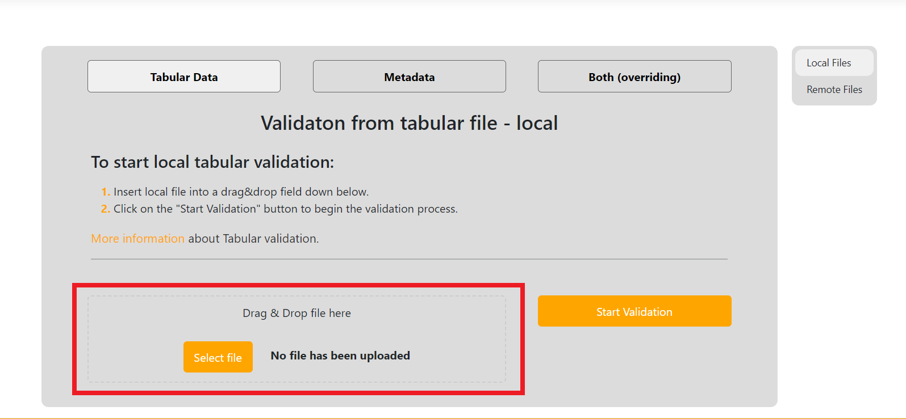
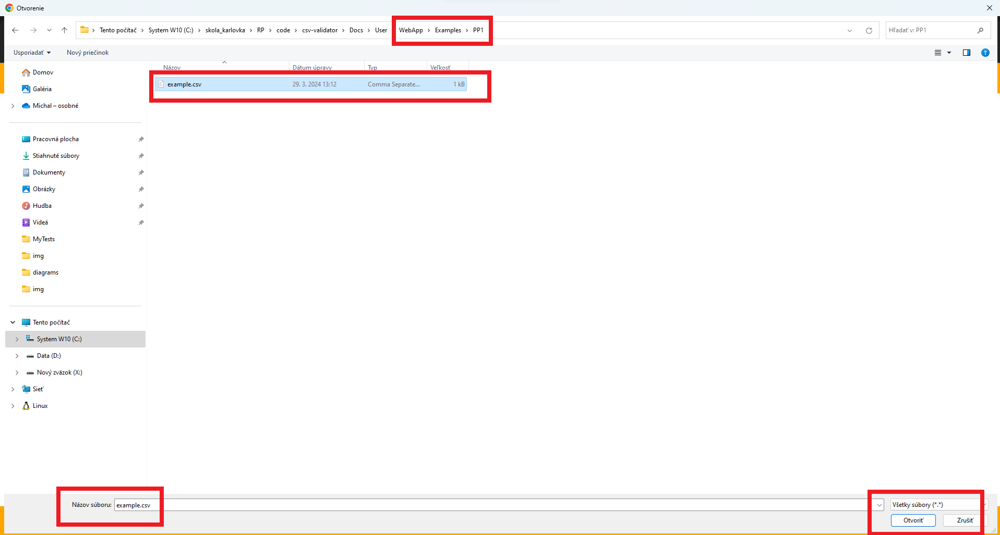
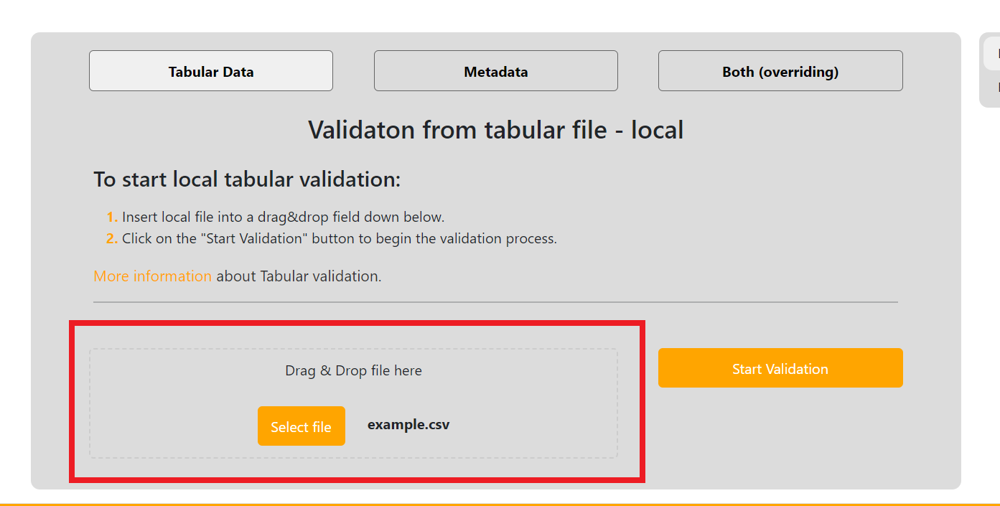
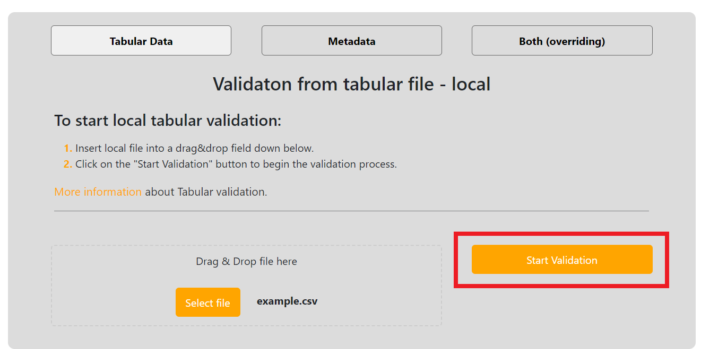
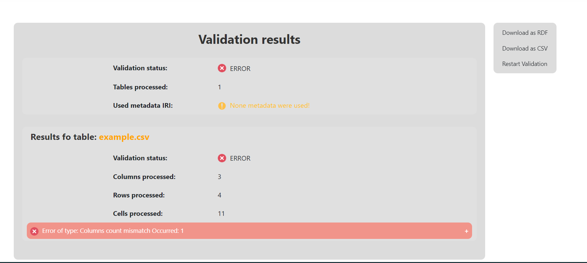
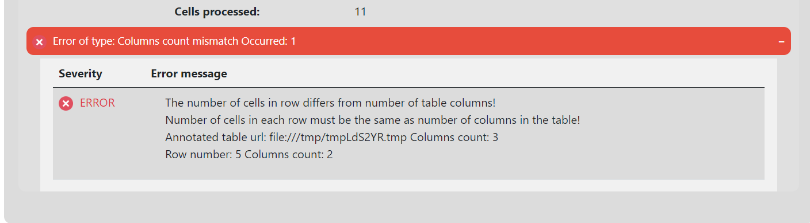

### Validation of local CSV file (PP1.)
Here we will work with the [PP1/example.csv](https://gitlab.mff.cuni.cz/kolcunm/csv-validator/-/blob/master/Docs/User/WebApp/Examples/PP1/example.csv?ref_type=heads)

First lets locate to the correct validate screen.
1. Click on the `Validate` link in the [Main navigation](user_web_app.md#main-navigation).
2. Click on the `Tabular Data` link in the [Second navigation](user_web_app.md#validate-screens-second-navigation).
3. Click on the `Local Files` link in the [Third navigation](user_web_app.md#validate-screens-third-navigation).

Now click on the `Drag&Drop` field:

File select window will open and we select our file and click open:

Afterwards your page should look like this:

Now start the validation by clicking the `Start Validation` button:

After the validation is done, you will be relocated to a result page:

We can see that there has been one Columns count mismatch error:

And that it belongs to the table `example.csv` as it contains different number of columns in some row.
