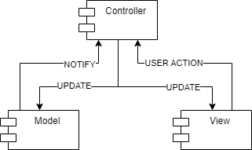
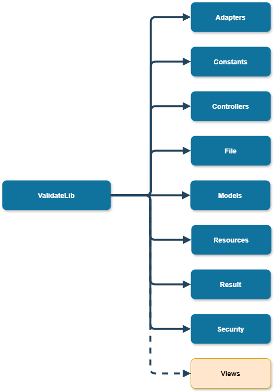

# Web App - developer documentation

Here you can find all that you need if you want to continue the development of the Validator library or to 
use it more advanced!

Don't forget to check out the [user documentation](../user/index.md) to get a grasp of what this library is all about!

Contents:
- **[Generated documentation](#generated-code-documentation)**
- **[General architecture](#general-architecture)**
- **[Contents of namespaces](#contents-of-namespaces)**

## Generated code documentation 
You can find the generated documentation from source code [here](generated/html/index.html).
It contains detailed description of all classes and interfaces we need.

## General architecture

The application is designed using common known architectural style [Model-View-Controller (MVC)](https://en.wikipedia.org/wiki/Model%E2%80%93view%E2%80%93controller).

You can see the general idea on the picture:

Here are some basic definitions of individual parts to refresh your knowledge:
- **Model** - In the MVC pattern, the **Model** represents the application's data and business logic. It encapsulates the data and behaviors that are relevant to the application, independent of the user interface. In an ASP.NET web application, the Model typically consists of classes that represent entities, data access logic (such as Entity Framework or ADO.NET code), validation rules, and other business logic. Models abstract away the database details and provide a structured approach to interact with data.
- **View** - The **View** in MVC represents the user interface (UI) of the application. It is responsible for presenting the data to the user in a human-readable format and for collecting input from the user. In an ASP.NET web application, Views are usually implemented as HTML templates mixed with server-side code (using Razor syntax in ASP.NET MVC). Views should be kept as lightweight as possible, containing minimal logic beyond what is necessary for rendering the UI elements dynamically.
- **Controller** - The **Controller** acts as an intermediary between the Model and the View. It receives user input from the View, processes it by interacting with the Model, and determines which View to display in response. In ASP.NET MVC, Controllers are classes that inherit from the Controller base class and contain action methods corresponding to different user interactions (e.g., handling HTTP requests). Controllers are responsible for orchestrating the flow of the application, handling business logic related to user input, and selecting the appropriate View to render.

So if you wish to extend the Web App you can add more `Models`, `Views` and `Controllers` as you wish!

## Contents of namespaces

On this picture you can see all the embedded name-spaces:

Now we will describe individual sub-namespaces:
- **[Adapters](#adapters)**
- **[Constants](#constants)**
- **[Controllers](#controllers)**
- **[File](#file)**
- **[Models](#models)**
- **[Resources](#resources)**
- **[Result](#result)**
- **[Security](#security)**
- **[Views](#views)**

### Adapters

Contains classes that tries to mitigate the differences between the library variants. For example we need to store the errors and warnings serialized into the db and this is what these classes enable.

### Constants

Contains just basic constants that are used from different modules of the Web Application for example like address of the web service that we use.

### Controllers

Contains instances of Controllers from the MVC pattern.

### File

Contains classes that helps to mitigate problems with the local files provided by the user. For example where to store them, afterwards we change from result page the temporary file names from the server to the file names that the user provided originally.

### Models

Contains instances of Models from the MVC pattern.

### Resources

Contains localized strings for the Web Application and its different views.

### Result

Contains result writers wrappers from the ValidateLib. As we do not store the errors and warnings to the database in the same form as the lib produces them we need to have some wrappers around the original classes from the library to mitigate the issue.

### Security

Contains classes that helps with the problem of security of the web app.
For example it contains class `Sanitizer` which sanitizes the input from the user for example if he did not provide too big file or some malicious file names that could harm the server.

### Views

Contains the instances of the Views from the MVC. Basically provides UI for the user using razor pages and basic javascript and html.