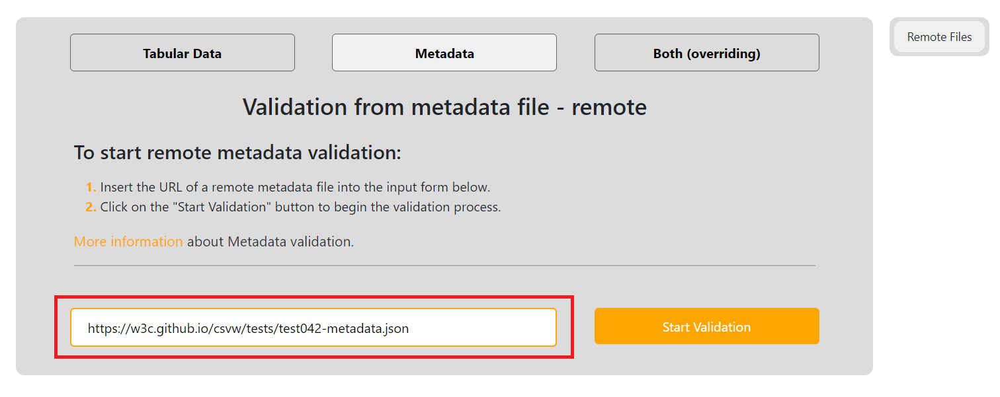
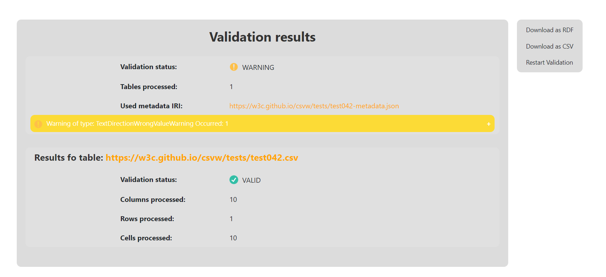

### Validation of remote metadata file (PP4.)
For this use case we will borrow one of the [integration tests](https://w3c.github.io/csvw/tests/#manifest-validation) specifically [test042](https://w3c.github.io/csvw/tests/#manifest-validation#test042).
Contents of this file will be are saved at [PP4/](https://gitlab.mff.cuni.cz/kolcunm/csv-validator/-/tree/master/Docs/User/WebApp/Examples/PP4).

First lets locate to the correct validate screen.
1. Click on the `Validate` link in the [Main navigation](index.md#main-navigation).
2. Click on the `Metadata Data` link in the [Second navigation](index.md#validate-screens-second-navigation).
3. Click on the `Remote Files` link in the [Third navigation](index.md#validate-screens-third-navigation).

Insert the `https://w3c.github.io/csvw/tests/test042/csv-metadata.json` into the `URL input` field:

Start the validation by clicking on the `Start Validation` button: 

Afterwards you will see the result page:

Here the warning of wrong text direction property value has occurred.