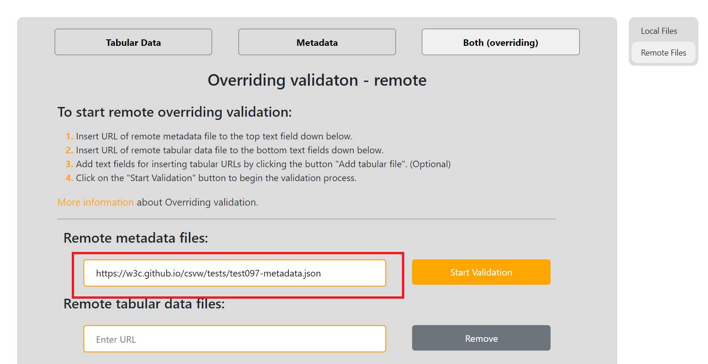
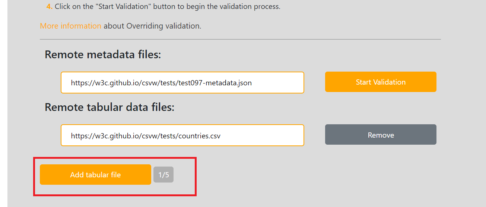
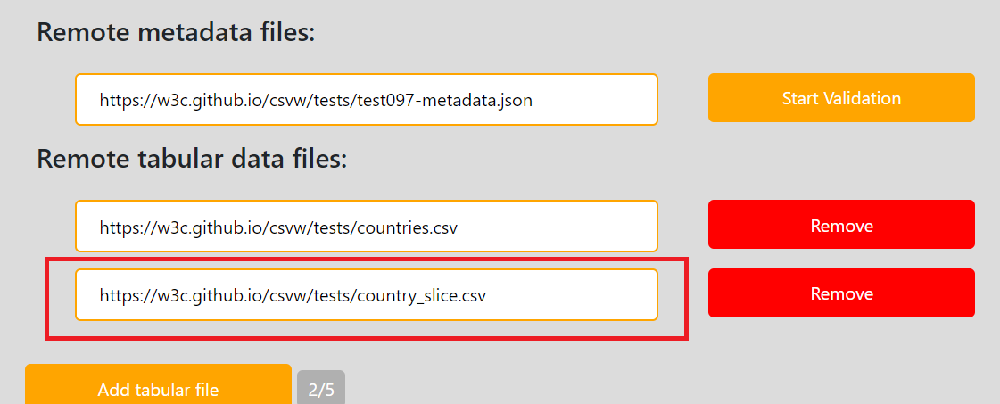
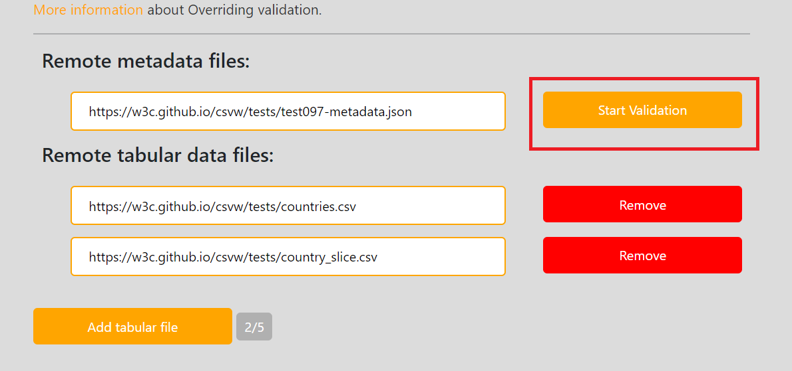

### Validation of remote table group with remote metadata file (PP6.)

For this use case we will borrow one of the [integration tests](https://w3c.github.io/csvw/tests/#manifest-validation) specifically [test097](https://w3c.github.io/csvw/tests/#manifest-validation#test097).
Contents of this file will be are saved at [PP6/](https://gitlab.mff.cuni.cz/kolcunm/csv-validator/-/tree/master/Docs/User/WebApp/Examples/PP6).

First lets locate to the correct validate screen.
1. Click on the `Validate` link in the [Main navigation](index.md#main-navigation).
2. Click on the `Both (overriding)` link in the [Second navigation](index.md#validate-screens-second-navigation).
3. Click on the `Remote Files` link in the [Third navigation](index.md#validate-screens-third-navigation).

Insert the `https://w3c.github.io/csvw/tests/test097-metadata.json` into the first `URL input` field:

Insert the `https://w3c.github.io/csvw/tests/countries.csv` into the second `URL input` field:

Add third input field by clicking `Add tabular file` button:

Insert the `https://w3c.github.io/csvw/tests/country_slice.csv` into the third `URL input` field:

Start the validation by clicking on the `Start Validation` button: 

Afterwards you will see the result page:

Here the warning of wrong object property value has occurred.